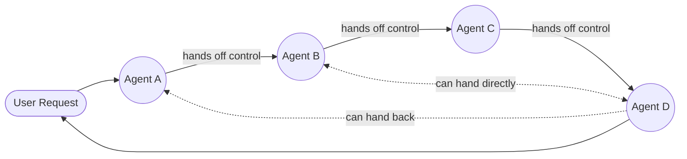
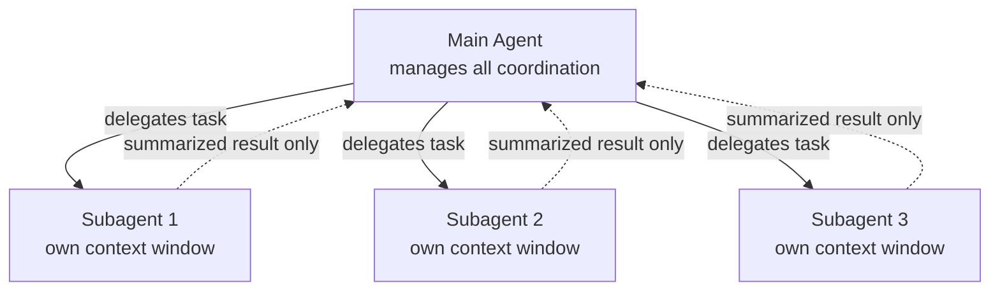
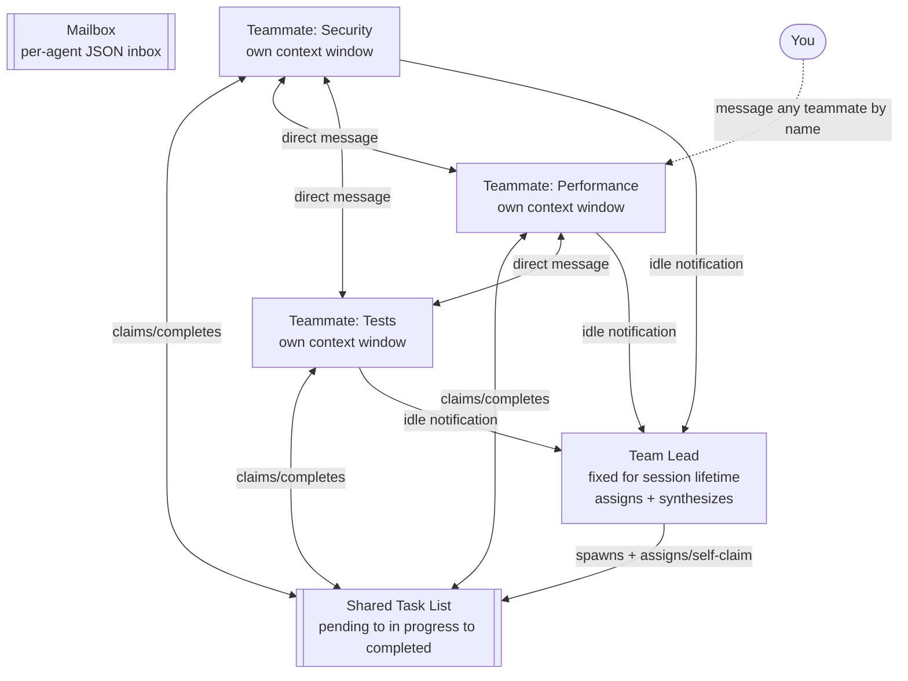

# Swarm vs. Subagents vs. Agent Teams

A comparison of three multi-agent coordination patterns, verified against Anthropic's official Claude Code documentation (`code.claude.com/docs/en/agent-teams`) and general multi-agent systems literature.

## The three patterns, precisely

**Swarm** — a general multi-agent *systems* term, not a Claude-specific feature. A true swarm is a decentralized network of agents operating without a central controller — agents react to their environment, communicate directly with peers, and adjust behavior to reach a shared goal, with no supervisor issuing instructions. Strictly, a swarm is sequential, decentralized control transfer: only one agent is active at a time, and agents hand off control to each other directly rather than running in parallel under a coordinator. No fixed leader — the "lead" role rotates with control itself.

**Subagents** (Claude Code) — hierarchical and isolated. Subagents run within a single session and can only report back to the main agent — they never talk to each other. Each has its own context window, but only its summarized result returns to the caller; the main agent manages all coordination. This is the lower-token-cost, "focused task, result only" pattern.

**Agent Teams** (Claude Code) — hierarchical *formation*, decentralized *execution*. One session acts as team lead, coordinating work, assigning tasks, and synthesizing results, while teammates work independently, each in its own context window, and communicate directly with each other — not just with the lead. Architecturally this runs on a team lead, teammates, a shared task list that teammates claim and complete, and a mailbox messaging system for agent-to-agent communication. Notably: the lead is fixed for the session's lifetime, teammates cannot spawn their own teammates, and a teammate's mailbox is a JSON file that delivers messages automatically without the lead needing to poll.

## Diagrams

### Swarm — decentralized, control hands off between peers

*No fixed leader — whichever agent currently holds control acts as coordinator until it hands off. Only one agent is typically active at a time.*

### Subagents — hierarchical, isolated, report-only

*Subagents never see each other. No task list, no mailbox — just delegate and return.*

### Agent Teams — lead-formed, peer-coordinated

*Teammates self-claim from a shared task list and message each other directly by name; the lead only assigns, synthesizes, and gets automatic idle notifications — it doesn't sit in the middle of every message.*

## Comparison table

| | Swarm | Subagents | Agent Teams |
|---|---|---|---|
| Coordinator | None — control rotates | Fixed main agent | Fixed lead (can't be transferred) |
| Peer-to-peer communication | Yes, by definition | No — never | Yes, via mailbox |
| Execution | Sequential, one active agent | Parallel, isolated | Parallel, coordinated |
| Task assignment | Local/emergent handoff | Main agent delegates each task | Lead assigns or teammates self-claim from shared list |
| Nesting | Varies by implementation | N/A | Not allowed — teammates can't spawn teammates |
| What returns | Whatever the active agent produces | Summarized result only | Full ongoing collaboration + synthesis |
| Token cost | Framework-dependent | Lower | Higher — each teammate is a full independent instance |
| Status in Claude Code | Not a built-in Claude Code feature — a general industry term | Stable | Experimental, opt-in flag (`CLAUDE_CODE_EXPERIMENTAL_AGENT_TEAMS=1`) |

## Note

"Swarm" isn't a Claude Code primitive at all — it's a general architecture term the community sometimes applies loosely to Agent Teams. Agent Teams is closer to a *bounded, lead-initiated* swarm than a true decentralized one, since the lead still starts the team and stays fixed for its lifetime.

---

*Sources: Anthropic Claude Code documentation (code.claude.com/docs/en/agent-teams), general multi-agent systems literature on swarm architectures.*
